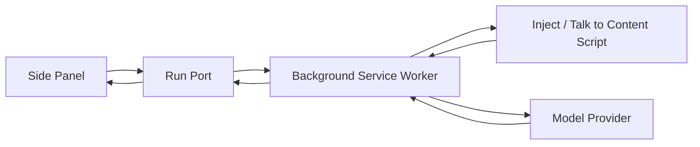

# Fast Browser

Fast Browser is an open-source Chrome extension for natural-language browser automation.

This repo is now packaged as an alpha-quality extension, not just a code prototype. You can build it, load it into Chrome, and use it on the active tab today.

This repo is intentionally starting small. The current scaffold now proves the core extension plumbing and the first real agent loop:

- Manifest V3 extension with a side panel
- background service worker
- content script
- DOM-native page extraction
- React side panel for task entry and local Ollama setup
- first observe → plan → act → verify loop against the active tab
- live step-by-step updates streamed to the side panel over a dedicated per-run extension Port
- runtime site access model shaped for a real alpha extension
- extension icon set and release packaging flow

Related docs:

- [Privacy Policy](./PRIVACY.md)
- [Security Policy](./SECURITY.md)
- [Release Guide](./RELEASING.md)

## Architecture

Fast Browser is a three-part extension:

- `background service worker`: owns orchestration, Ollama calls, action execution, cancellation, and run state
- `content script`: snapshots the active page, resolves refs, and performs DOM-native page interactions
- `side panel`: collects the task, local model settings, and live phase updates

The current DAG is a single-run observe → plan → act → verify loop. Each run gets its own Port session, and the UI derives from streamed phase events instead of polling.

## Message Flow

1. The user enters a task in the side panel.
2. The side panel sends the request to the background worker.
3. The background worker snapshots the active tab through the content script.
4. The worker sends the snapshot to the configured model and asks for exactly one JSON action.
5. The worker validates the action, executes a safe browser operation, and streams the result back to the panel.
6. The content script re-extracts the page so stale refs expire immediately.
7. The loop repeats until the task is done, blocked, cancelled, or the step budget is exhausted.



## Current scope

This is not a full browser agent yet. The current implementation is focused on the first trustworthy slice:

The working loop today is:

1. Open the side panel
2. Make sure Ollama is running locally
3. Enter a task
4. Run the loop on the active tab
5. Observe a structured page snapshot
6. Ask the model for exactly one JSON action
7. Execute a small safe action set
8. Re-observe and continue until done, blocked, or out of steps

Supported action types in this slice:

- `click`
- `type`
- `scroll`
- `wait`
- `navigate`
- `done`
- `ask_human`

The content script treats refs as snapshot-local. After every action, the page is re-extracted and old refs expire immediately.

Each run now uses its own Port session, server events carry monotonically increasing `seq` numbers, and the side panel derives its UI state directly from the streamed phase events. Runs can also be cancelled explicitly, with cancellation threaded through the active model call and browser actions.

## Security Model

- The extension uses a Manifest V3 service worker and a strict extension-page CSP.
- User tasks and model outputs are treated as untrusted input.
- Fast Browser is now Ollama-only, so no third-party API key is required for the alpha flow.
- Page refs are snapshot-local and expire after every re-extraction.
- The action surface is intentionally small so the worker can reject anything outside the safe set.
- Sensitive fields are detected in the content script and type actions against them are blocked.
- Cross-origin navigation requires explicit human approval before the worker will proceed.
- API access to sites is shaped around the active tab plus optional runtime-granted site access, instead of a permanently broad install-time permission model.
- Prompt injection defenses are still a work in progress, so the current build is not suitable for high-risk autonomous browsing without more hardening.

## Local Ollama setup

Fast Browser now targets local Ollama only. That makes the alpha much simpler to install, cheaper to use, and easier to reason about.

Quick start:

```bash
ollama serve
ollama pull llama3.2:3b
```

Then reload the extension and choose `llama3.2:3b` in the side panel.

If you change the endpoint manually, keep it on Ollama's OpenAI-compatible chat-completions path:

```text
http://127.0.0.1:11434/v1/chat/completions
```

If you want a different free local model later, install it first and then type or select it in the model setup:

```bash
ollama pull qwen2.5:3b
ollama pull gemma3:4b
```

What is still intentionally missing:

- richer action types like `select`, `extract`, or multi-action plans
- robust page-settling logic for highly dynamic apps
- file upload, iframe, and rich-editor flows
- production-grade prompt-injection hardening
- persistent long-term memory across runs

## Known Limitations

- The extension is now set up for runtime site access, but the active-tab + per-site permission model still needs more real-world testing across sites.
- The DOM extractor currently ignores iframes and shadow DOM.
- Page snapshots are intentionally capped at 60 interactive elements and 2500 visible-text characters.
- The current action set is intentionally narrow and does not yet cover form controls beyond typing into the active target.
- The prompt format expects one JSON action per step, so multi-step plans are not yet supported.
- The current security model reduces risk, but it does not fully solve prompt injection or malicious page content.
- The side panel only knows which models are ready if your local Ollama server is reachable from the extension.

## Production Host Permissions

For production, narrow the host permissions in `manifest.config.ts` before shipping.

- Prefer domain-scoped permissions instead of `<all_urls>`
- Keep `activeTab` for user-initiated access where possible
- Only add explicit host permissions for domains your extension must automate
- Use `chrome.permissions.request()` for optional runtime elevation instead of bundling broad access by default
- Rebuild and retest after any permission change

The current manifest already includes a CSP for extension pages:

```ts
content_security_policy: {
  extension_pages: "script-src 'self'; object-src 'none';",
},
```

## Development

```bash
npm install
npm run dev
```

Then load the built extension in Chrome from `dist/`, make sure `ollama serve` is running, and reload the extension after installing any new model.

## Package For Chrome

```bash
npm run package:extension
```

That produces `fast-browser-extension.zip` for release testing or store submission prep.

## Build

```bash
npm run build
```

## Test

```bash
npm test
```

## Roadmap

Near-term priorities:

- add a small action verifier and better page-settling logic
- support richer but still safe actions like `select` and `extract`
- harden prompt-injection defenses before broader release
- tighten host permissions for production deployment
